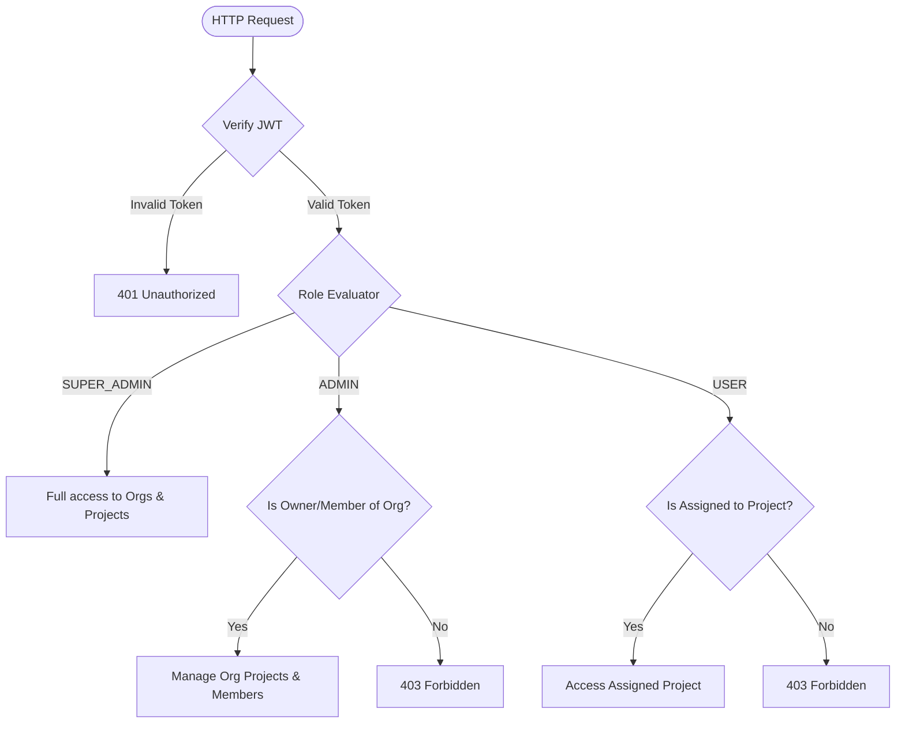

# TenantSphere 🌐
### Enterprise Multi-Tenant SaaS Backend Engine

A robust, production-ready, and highly secure multi-tenant backend engine built with **Node.js**, **Express.js**, and **MongoDB/Mongoose**. The system is designed to provide strict tenant data isolation, granular Role-Based Access Control (RBAC), secure authentication session handling, and structured validation.

---

## 🚀 Key Architectural Highlights

*   **Strict Multi-Tenant Isolation**: Complete logical and database boundaries between different organizations. Cross-tenant data leakages are systematically prevented at the controller level.
*   **Granular Role-Based Access Control (RBAC)**: Enforces three distinct access layers:
    *   **Superadmins**: Global application control. Can manage organizations, update ownerships, and view all projects across the entire system.
    *   **Org Admins**: Full operational control over their specific organization, including adding organization members and performing full CRUD operations on all projects within that organization.
    *   **Project Members**: Strictly confined to accessing only the specific projects they have been added to, with zero exposure to other projects within the same or different organizations.
*   **Tenant Safety Constraints**: When adding members to a project, the engine validates that the target users belong to the organization. This guarantees that external users cannot be slipped into a tenant's internal project.
*   **Production-Grade Logging**: Utilizes **Winston** for custom error/info logging and **Morgan** for detailed HTTP request stream tracking.
*   **Robust Input Validation**: Strict validation for all requests using **Zod schemas**, keeping the controller logic focused on business rules.
*   **Centralized Error Handling**: Built with custom `ApiError` and `ApiResponse` wrappers to return structured JSON errors/success payloads instead of leaking raw server stacks.

---

## 📂 Project Architecture

```
TenantSphere/
├── src/
│   ├── app.js                    # Express app configuration & middleware pipeline
│   ├── index.js                  # Application entry point & Database initialization
│   ├── constants.js              # Application constants (Roles, Login types)
│   ├── controllers/
│   │   ├── auth.controllers.js   # Authentication & Profile management
│   │   ├── org.controllers.js    # Multi-tenant Organization controllers
│   │   └── project.controllers.js# Project lifecycle & isolation controllers
│   ├── middlewares/
│   │   ├── auth.middleware.js    # JWT authorization & role verification middlewares
│   │   └── multer.middleware.js  # File upload middleware (Cloudinary utility integration)
│   ├── models/
│   │   ├── user.models.js        # User Schema, passwords hashing, token generation
│   │   ├── org.models.js         # Organization Schema (owner & members arrays)
│   │   └── project.models.js     # Project Schema (org binding & project members array)
│   ├── routes/
│   │   ├── auth.routes.js        # Auth & profile route definitions
│   │   ├── org.routes.js         # Organization management route definitions
│   │   └── project.routes.js     # Project CRUD and member assignment route definitions
│   ├── utils/
│   │   ├── ApiError.js           # Customized API error wrapper class
│   │   ├── ApiResponse.js        # Customized API response wrapper class
│   │   ├── asyncHandler.js       # Asynchronous router handler wrapper
│   │   ├── cloudinary.js         # Cloudinary asset storage connector
│   │   ├── db.js                 # Mongoose MongoDB connection initializer
│   │   └── mail.js               # Mailtrap / Nodemailer communication handler
│   ├── validators/
│   │   ├── auth.validators.js    # Zod schemas for login and registrations
│   │   ├── org.validators.js     # Zod schemas for organization creation & members
│   │   └── project.validators.js  # Zod schemas for project CRUD operations
│   ├── logger/
│   │   ├── winston.logger.js     # Winston logs configuration
│   │   └── morgan.logger.js      # Morgan routing logs configuration
│   └── passport/
│       └── index.js              # OAuth 2.0 configuration (Google & GitHub Strategies)
├── public/                       # Static resource directory
├── .env.sample                   # Environment configuration template
└── package.json                  # Node.js dependencies configuration
```

---

## 🛠️ Technology Stack

*   **Core**: [Node.js](https://nodejs.org/) & [Express.js](https://expressjs.com/) v5
*   **Database**: [MongoDB](https://www.mongodb.com/) via [Mongoose ODM](https://mongoosejs.com/)
*   **Authentication**:
    *   [Passport.js](https://www.passportjs.org/) for Google OAuth Integration.
    *   [JSON Web Tokens (JWT)](https://jwt.io/) for access/refresh session control.
    *   [Bcrypt.js](https://github.com/dcodeIO/bcrypt.js) for high-entropy password hashing.
*   **Validation**: [Zod](https://zod.dev/) Schema Validation
*   **Assets Storage**: [Multer](https://github.com/expressjs/multer) & [Cloudinary SDK](https://cloudinary.com/)
*   **Transactional Email**: [Nodemailer](https://nodemailer.com/) + [Mailgen](https://github.com/eladnava/mailgen)
*   **Logging System**: [Winston](https://github.com/winstonjs/winston) & [Morgan](https://github.com/expressjs/morgan)

---

## 🔐 Multi-Tenant Authorization Matrix

The table below illustrates the permission boundary enforced across the organization resources:

| Action | Superadmin | Org Admin (Owner/Member) | Project Member (User) | Guest / Unauthenticated |
| :--- | :---: | :---: | :---: | :---: |
| **Create Org** | ✅ Yes | ❌ No | ❌ No | ❌ No |
| **List Orgs** | ✅ View All | ✅ View Belonging Orgs | ✅ View Belonging Orgs | ❌ No |
| **Add Org Member** | ✅ Yes | ✅ Yes (Within Own Org) | ❌ No | ❌ No |
| **Update Org** | ✅ Yes | ✅ Yes (Within Own Org) | ❌ No | ❌ No |
| **Delete Org** | ✅ Yes | ❌ No | ❌ No | ❌ No |
| **Create Project** | ✅ Yes | ✅ Yes (Within Own Org) | ❌ No | ❌ No |
| **List Projects** | ✅ View All | ✅ View All in Own Org | ✅ View Assigned Only | ❌ No |
| **Get Project** | ✅ Yes | ✅ Yes (Within Own Org) | ✅ Yes (If Assigned) | ❌ No |
| **Update Project** | ✅ Yes | ✅ Yes (Within Own Org) | ❌ No | ❌ No |
| **Delete Project** | ✅ Yes | ✅ Yes (Within Own Org) | ❌ No | ❌ No |

---

## 👥 Access Isolation Flows



---

## 🗄️ Database Schemas

### 1. User Schema (`User`)
Represents the user account, registration status, OAuth profiles, and platform roles.
*   `email` (String, Unique, Required): Primary identifier.
*   `role` (String, Enum: `SUPER_ADMIN`, `ADMIN`, `USER`): Enforces RBAC permissions.
*   `password` (String, Required): Hashed with Bcrypt.
*   `avatar` (String): Cloudinary link to the user's avatar image.
*   `isEmailVerified` (Boolean): Flag for transactional email validation flow.
*   `loginType` (String, Enum: `GOOGLE`, `GITHUB`, `EMAIL_PASSWORD`): Tracks origin provider.
*   `refreshToken` (String): Stored for token rotation protocol.

### 2. Organization Schema (`Org`)
Represents a Tenant workspace.
*   `name` (String, Required): The name of the organization.
*   `description` (String): Brief overview of the organization.
*   `owner` (ObjectId, Ref: `User`, Required): Pointer to the primary administrator of the tenant.
*   `members` (Array of ObjectIds, Ref: `User`): Array of users mapped to the organization workspace.

### 3. Project Schema (`Project`)
Represents a project situated inside an organization.
*   `name` (String, Required): Project name (must be unique within the organization).
*   `description` (String): Project overview.
*   `org` (ObjectId, Ref: `Org`, Required): Strict link to the parent organization.
*   `members` (Array of ObjectIds, Ref: `User`): List of users assigned to this specific project.
*   `createdBy` (ObjectId, Ref: `User`, Required): User who initialized the project.

---

## 📡 API Reference

All requests must have the prefix `/api/v1`. Protected routes require providing the token via `Authorization: Bearer <accessToken>` or cookies.

### 🔑 Authentication Routes (`/auth`)

*   `POST /auth/register`
    *   Registers a new user account.
    *   **Body**: `{ "email": "user@example.com", "password": "securePassword123#" }`
*   `POST /auth/login`
    *   Authenticates credentials, returns user profile, access token, and sets cookies.
    *   **Body**: `{ "email": "user@example.com", "password": "securePassword123#" }`
*   `POST /auth/logout` (Protected)
    *   Logs out the authenticated user and clears session tokens.
*   `POST /auth/refresh-token`
    *   Uses cookie-based refresh token to return a rotated access token.
*   `GET /auth/verify-email/:verificationToken`
    *   Marks the user's email verified based on validation code.
*   `POST /auth/forgot-password`
    *   Triggers forgot password email flow with reset token link.
*   `POST /auth/reset-password/:resetToken`
    *   Sets a new password using the provided time-restricted reset token.
*   `POST /auth/change-password` (Protected)
    *   Changes password using credentials verification.
*   `GET /auth/current-user` (Protected)
    *   Fetches profile data of the logged-in session owner.
*   `PATCH /auth/avatar` (Protected)
    *   Updates user avatar utilizing a `multipart/form-data` request under the `avatar` file field.

---

### 🏢 Organization Routes (`/org`)

*   `POST /org` (Protected, `SUPER_ADMIN`)
    *   Creates a new tenant workspace.
    *   **Body**: `{ "name": "Google", "description": "Tech company workspace" }`
*   `GET /org` (Protected)
    *   Lists organizations. Superadmins see all; Admins and standard Users see organizations where they are owner or member.
*   `GET /org/:orgId` (Protected)
    *   Fetches organization workspace details. Access restricted to Superadmins, Org owner, or Org members.
*   `PATCH /org/:orgId` (Protected, `SUPER_ADMIN` or Org `ADMIN`)
    *   Updates organization properties (name, description).
*   `DELETE /org/:orgId` (Protected, `SUPER_ADMIN`)
    *   Deletes organization from the database.
*   `POST /org/:orgId/members` (Protected, `SUPER_ADMIN` or Org `ADMIN`)
    *   Adds a user to the organization's members.
    *   **Body**: `{ "memberId": "6a11a3d5a44842ee1900e7df" }`

---

### 📁 Project Routes (`/project`)

*   `POST /project` (Protected, `SUPER_ADMIN` or Org `ADMIN`)
    *   Creates a project inside a specific organization. Validates that all members specified in the `members` array belong to the parent organization.
    *   **Body**: `{ "orgId": "...", "name": "Alpha Project", "description": "First Phase", "members": ["userId1", "userId2"] }`
*   `GET /project` (Protected)
    *   List projects. Superadmins see all projects; Org Admins see all projects in their orgs; standard Users see only projects they are assigned to.
*   `GET /project/:projectId` (Protected)
    *   Fetches project details. Allowed for Superadmins, Org Admins, and assigned project members.
*   `PATCH /project/:projectId` (Protected, `SUPER_ADMIN` or Org `ADMIN`)
    *   Updates project attributes (name, description, members). Enforces that any new members are part of the parent organization.
*   `DELETE /project/:projectId` (Protected, `SUPER_ADMIN` or Org `ADMIN`)
    *   Removes the project workspace.

---

## ⚙️ Installation & Setup

Follow these steps to run the application locally:

### 1. Clone the repository
```bash
git clone https://github.com/arush73/team_shiksha_assignment.git
cd team_shiksha_assignment
```

### 2. Install dependencies
```bash
npm install
```

### 3. Setup Environment Configuration
Create a `.env` file in the project root:
```env
PORT=8080
MONGODB_URI=mongodb://127.0.0.1:27017
NODE_ENV=development

# Authentication Secrets
EXPRESS_SESSION_SECRET=superSecretSessionKey123#
ACCESS_TOKEN_SECRET=accessTokenSecretSignatureKey456#
ACCESS_TOKEN_EXPIRY=1d
REFRESH_TOKEN_SECRET=refreshTokenSecretSignatureKey789#
REFRESH_TOKEN_EXPIRY=10d

# Cross-Origin Resource Sharing
CORS_ORIGIN=http://localhost:3000

# Cloudinary Integration (Asset Storage)
CLOUDINARY_CLOUD_NAME=your_cloudinary_cloud_name
CLOUDINARY_API_KEY=your_cloudinary_api_key
CLOUDINARY_API_SECRET=your_cloudinary_api_secret

# Email Config (Mailtrap SMTP for Sandbox Testing)
MAILTRAP_SMTP_HOST=sandbox.smtp.mailtrap.io
MAILTRAP_SMTP_PORT=2525
MAILTRAP_SMTP_USER=your_mailtrap_smtp_user
MAILTRAP_SMTP_PASS=your_mailtrap_smtp_pass

# Google OAuth Keys
GOOGLE_CLIENT_ID=your_google_client_id
GOOGLE_CLIENT_SECRET=your_google_client_secret
GOOGLE_CALLBACK_URL=http://localhost:8080/api/v1/auth/google/callback

# Frontend Redirection Rules
CLIENT_SSO_REDIRECT_URL=http://localhost:3000/user/profile
FORGOT_PASSWORD_REDIRECT_URL=http://localhost:3000/forgot-password
```

### 4. Running the Development Server
```bash
npm run dev
```
The server will boot and connect to MongoDB, spinning up on `http://localhost:8080`.

---

## 🧪 Testing Seeding / Pre-configured Credentials

To quickly run checks against the API, you can authenticate using the following built-in users:

1.  **Super Admin Account**:
    *   **Email**: `super.admin@superadmin.com`
    *   **Password**: `superadmin123#`
2.  **Organization Admin Account**:
    *   **Email**: `admin@admin.com`
    *   **Password**: `admin123#`
3.  **Project Member Account 1**:
    *   **Email**: `member.1@member.com`
    *   **Password**: `member1123#`
4.  **Project Member Account 2**:
    *   **Email**: `member.2@member.com`
    *   **Password**: `member2123#`

---

Built with ❤️ for strict security, reliability, and scale by [Arush Choudhary](https://github.com/arush73).
